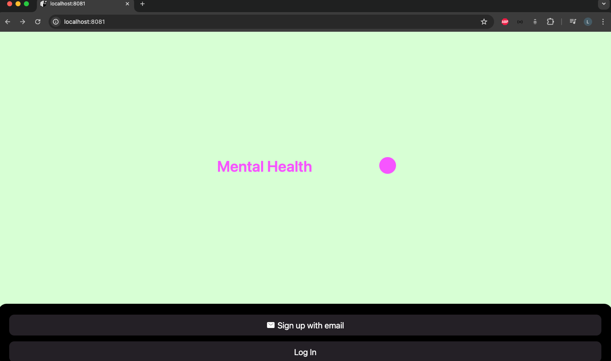
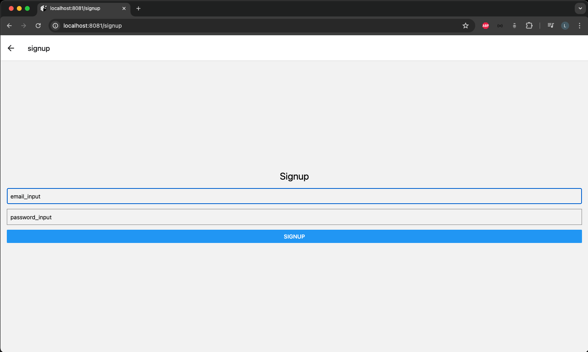
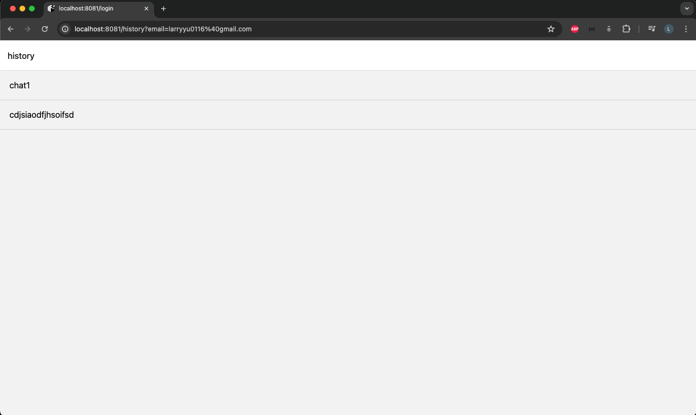
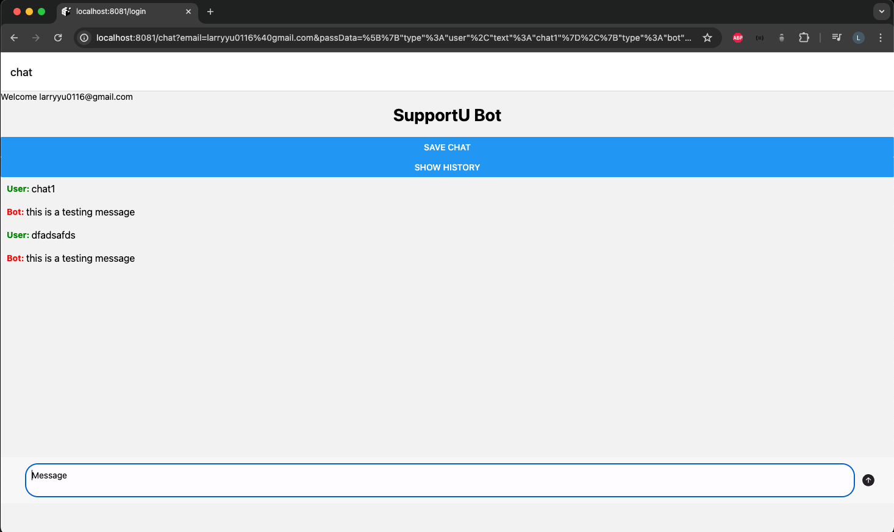
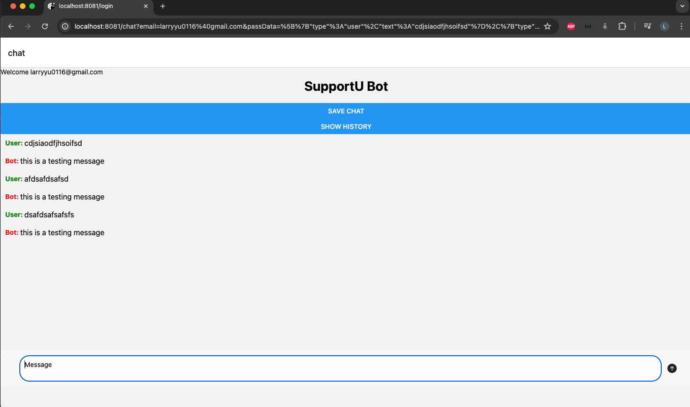

# Support U

### How to run
Backend: 

1. cd to backend
1. !!! IMPORTANT - update api key, email, and email password in ./backend/utils/config.py
1. Start a python environment
2. Install -r requirements.txt
3. Run routesv1.py

UI:
1. npm install
2. npm run ios (ios app)   npm run web (web)

### Deployment
Current the entire application is running locally. To deploy this application, first it will need to be break down into modules.

1. Database will use cloud DB (aws for example)
2. The routes can act as a serverless function (aws Lambda)
2. The Expo app (react native) can either be deploy to APP Store directly or host as a web (aws amplify)

### Screenshots

